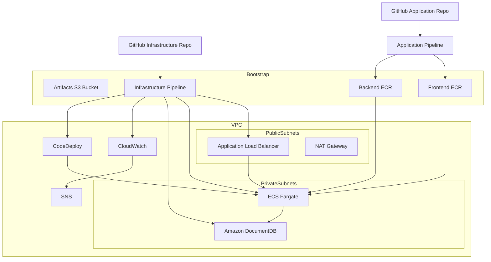
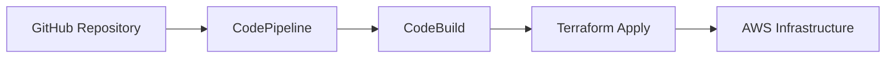
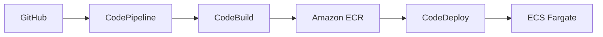
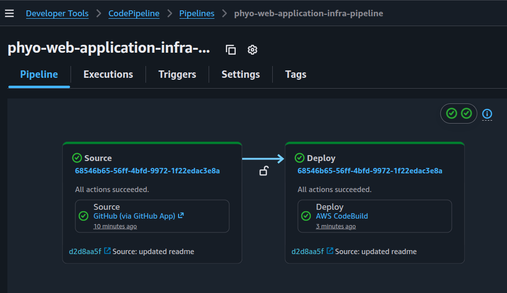
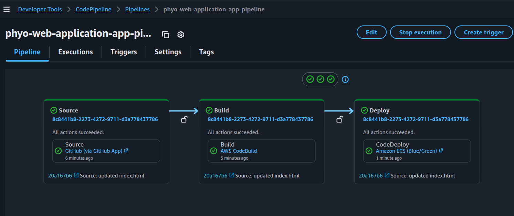
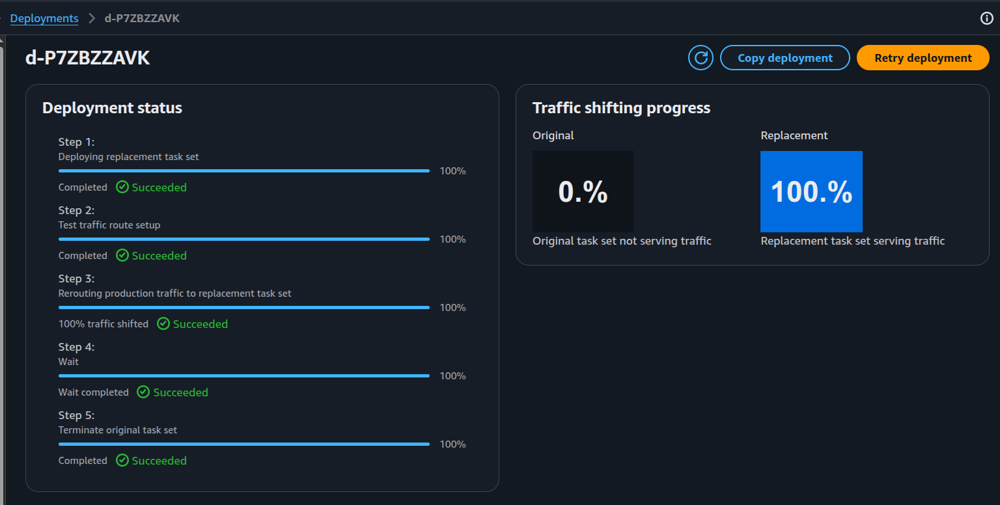
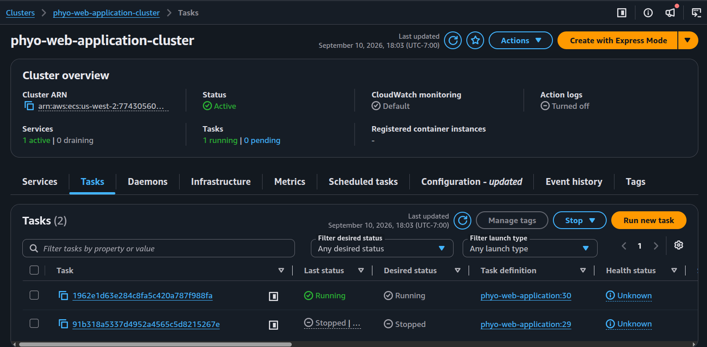
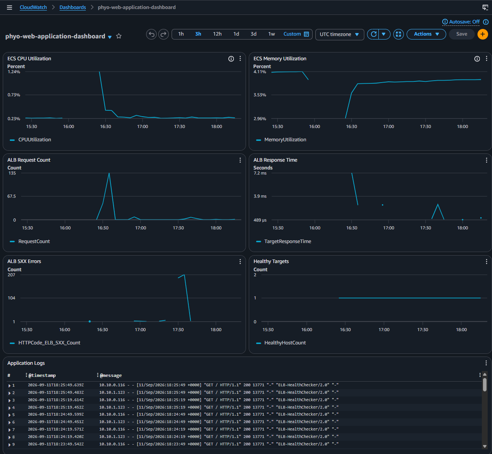

# 🚀 Enterprise CI/CD Platform on AWS
### Terraform | ECS Fargate | Blue/Green Deployments

## 📑 Table of Contents

- project-overview
- business-problems-solved
- solution-highlights
- project-evolution
- aws-architecture-diagram--overview
- architecture-overview
- repository-structure
- infrastructure-design
- cicd-architecture
- bluegreen-deployment-strategy
- monitoring--observability
- security-design
- key-learning-concepts
- features
- solution-screenshots
- technologies-used
- lessons-learned
- challenges--solutions
- future-enhancements
- how-to-run-this-project

---

## 📖 Project Overview
This project implements a production-style AWS container platform using Infrastructure as Code and automated CI/CD pipelines.

The platform separates infrastructure and application lifecycles into independent pipelines:

- Infrastructure Pipeline provisions and updates AWS resources using Terraform.
- Application Pipeline deploys application releases using Amazon ECS Blue/Green deployments with AWS CodeDeploy.

The solution demonstrates enterprise DevOps practices including:

- Infrastructure as Code (Terraform)
- Containerized workloads (Docker)
- ECS Fargate
- Blue/Green deployments
- CloudWatch monitoring and alerting
- Secure secret management with SSM Parameter Store
- Custom VPC networking
- Application Load Balancer
- DocumentDB database integration
- GitHub integration using CodeStar Connections

---

## 💼 Business Problems Solved

This project addresses several common challenges in modern cloud environments:

- **Manual Infrastructure Provisioning**  
  Terraform provisions and manages AWS resources as code, enabling repeatable and consistent deployments.

- **Application Downtime During Releases**  
  Blue/Green deployments with AWS CodeDeploy enable zero-downtime deployments and reduce release risk.

- **Limited Observability**  
  CloudWatch dashboards, logs, and alarms provide visibility into application health, performance, and operational issues.

- **Secret Management Risks**  
  Sensitive values such as database credentials and connection strings are securely stored in AWS Systems Manager Parameter Store rather than being embedded in source code.

- **Infrastructure Drift and Environment Inconsistency**  
  Infrastructure and application changes are deployed through version-controlled CI/CD pipelines, ensuring consistency across deployments.
---

### ⭐ Solution Highlights
| Area | Implementation |
|------|----------------|
| Infrastructure as Code | Terraform |
| Container Platform | Amazon ECS Fargate |
| Load Balancing | Application Load Balancer (ALB) |
| Database | Amazon DocumentDB |
| CI/CD | AWS CodePipeline + AWS CodeBuild |
| Deployment Strategy | AWS CodeDeploy Blue/Green Deployment |
| Monitoring | Amazon CloudWatch |
| Alerting | Amazon SNS |
| Security | AWS WAF + Security Groups + AWS Systems Manager Parameter Store |
| DNS | Amazon Route 53 |
| Certificates | AWS Certificate Manager (ACM) |

---

## 🧬 Project Evolution
### From Basic ECS Deployment to an Enterprise-Style AWS Platform

This project evolved from an earlier AWS ECS deployment platform into a more production-oriented cloud architecture.

previous project: https://github.com/phyomauk/terraform-my-simple-web

### Initial Architecture
The original project implemented a straightforward container deployment workflow:
```text
GitHub
    ↓
CodePipeline
    ↓
CodeBuild
    ↓
Amazon ECR
    ↓
Amazon ECS
```
Features:

- Single deployment pipeline
- ECS rolling deployments
- Basic networking
- No database layer
- Limited monitoring

### Improvements Introduced
✅ Separate Infrastructure and Application Repositories

✅ Infrastructure Pipeline and Application Pipeline

✅ Amazon DocumentDB Integration

✅ CloudWatch Dashboards and Alerts

✅ Systems Manager Parameter Store

✅ AWS WAF

✅ ECS Blue/Green Deployments with CodeDeploy

---

### Result

The platform evolved from a simple ECS deployment solution into a production-style AWS environment that supports:

- Infrastructure as Code
- Automated deployments
- Zero-downtime releases
- Secure secret management
- Monitoring and alerting
- Scalable cloud-native architecture

---

## 📐 AWS Architecture Diagram & Overview

---

## 🏗️ Architecture Overview
This project consists of: 

### Boostrap Layer
Provisions foundational resources:
- ECR Repositories
- IAM Roles
- Artifact S3 Bucket
- Infrastructure Pipeline

### Infrastructure Layer
Provisioned through the Infrastructure Pipeline:
- VPC
- Public and Private Subnets
- NAT Gateway
- Security Groups
- Application Load Balancer
- ECS Cluster
- ECS Service
- DocumentDB
- Route53
- WAF
- CloudWatch
- SNS
- CodeDeploy
- Application Pipeline

### Application Layer
Provisioned through the Application Pipeline:
- Frontend Container
- Backend Container
- ECS Task Definition Revisions
- Blue/Green Deployments

---
## 🎯 Key Architectural Decisions

### Why Separate Infrastructure and Application Pipelines?

Infrastructure and application deployments have independent lifecycles. Separating pipelines allows infrastructure changes and application releases to be managed independently.

### Why ECS Fargate?

ECS Fargate eliminates server management responsibilities while providing a scalable container platform.

### Why Parameter Store Instead of Secrets Manager?

AWS Systems Manager Parameter Store was selected to minimize operational costs while still providing secure secret storage and ECS integration.

For a production environment, I would prefer AWS Secrets Manager because it supports automatic secret rotation and advanced secret lifecycle management.

### Why Blue/Green Deployments?

Blue/Green deployments reduce deployment risk by validating new application versions before production traffic is shifted.

---


## 📂 Repository Structure
- ### Infrastructure Repository
```Infrstructure directory structure
terraform-my-web-application/

└── terraform_project
    ├── buildspecs
    │   └── infra
    │       └── infra.yml
    │
    ├── bootstrap
    │
    ├── modules
    │   ├── networking
    │   ├── security
    │   ├── alb
    │   ├── ecs
    │   ├── documentdb
    │   ├── codedeploy
    │   ├── cloudwatch
    │   ├── sns
    │   ├── route53
    │   ├── waf
    │   ├── parameterstore
    │   ├── codebuild_app
    │   └── codepipeline_app
    │
    └── environments
        └── prod
```
- ### Application Repository
```Application repository structure

my-web-application/

├── frontend
│   ├── app/
|   ├── default.conf
│   └── Dockerfile
│
├── backend
│   ├── package.json
│   ├── server.js
│   └── Dockerfile
│
└── aws
    ├── buildspec.yml
    ├── taskdef.json
    └── appspec.yaml
```
---
## 🧱 Infrastructure Design
### Networking
The platform runs inside of a custom VPC.
```text
VPC
├── Public Subnet A
├── Public Subnet B
├── Private Subnet A
├── Private Subnet B
├── DocumentDB Subnet A
└── DocumentDB Subnet B
```
Components
- Internet Gateway, NAT Gateway, Public Route Tables, Private Route Tables
---

### Load Balancing
Traffic enters through an Application Load Balancer.
Listeners
```text
80     HTTP Redirect
443    Production Traffic
8443   Test Traffic
```

Target Groups
```text
Blue Target Group
Green Target Group
```
These target groups support Blue/Green deployments.

---

### Compute
#### Amazon ECS Fargate
The application consists of two containers:
```text
Frontend Container (Nginx)
Backend Container  (Nodejs)
```
The containers run within ECS Fargate tasks hosted in private subnets.

---

### Database
#### Amazon DocumentDB
DocumentDB provides:
```text
Managed MongoDB-Compatible Database
Private Subnet Deployment
Security Group Isolation
Multi-AZ Subnet Group
```
---

### Secret Management
AWS Systems Manager Parameter Store stores:
```text
Database Username
Database Password
DocumentDB Connection String
```
Secrets are securely injected into ECS tasks at runtime.

---

## 🔄 CI/CD Architecture
### Infrastructure Pipeline
#### Purpose

- Provisions and manages all platform infrastructure.

#### Workflow


```text
GitHub
   ↓
CodePipeline
   ↓
CodeBuild
   ↓
Terraform Validate
   ↓
Terraform Plan
   ↓
Terraform Apply
   ↓
AWS Infrastructure
```

Resources Managed
```text
Networking
Security Groups
ALB
DocumentDB
ECS
CloudWatch
SNS
CodeDeploy
Application Pipeline
```
---

### Application Pipeline
#### Purpose

- Builds and deploys application releases.

#### Workflow


```text
GitHub
   ↓
CodePipeline
   ↓
CodeBuild
   ↓
Docker Build
   ↓
Amazon ECR
   ↓
Generate taskdef.json
Generate appspec.yaml
   ↓
CodeDeploy
   ↓
Blue/Green Deployment
```
---

## 🚢 Blue/Green Deployment Strategy
### Before Deployment
```text
Production Traffic
        ↓
      Blue
```
---

### During Deployment
```text
Blue Environment
    v1

Green Environment
    v2
```
CodeDeploy verifies:
- Container startup
- Target group health checks
- ALB health checks
---

### After Validation
Traffic shifts:
```text
Blue
  ↓
Green
```
if validation fails:
```
Automatic Rollback
```
restores traffic to the previous application version.

---

## 📊 Monitoring & Observability
### CloudWatch Logs

All ECS container logs are centralized:
```text
/ecs/project-name
```

### CloudWatch Dashboard
Dashboard visualizes:
```text
ECS CPU Utilization
ECS Memory Utilization
ALB Request Metrics
Application Logs
```
---

### CloudWatch Alarms
#### ECS
```text
CPU Utilization > 80%
Memory Utilization > 80%
```
#### Application Load Balancer
```text
5XX Errors
Target Response Time
```
---

### Alerting
```text
CloudWatch Alarm
      ↓
 SNS Topic
      ↓
 Email Notification
 ```
 ---

 ## 🔐 Security Design
### Network Security

Application architecture follows a private-by-default model.
```text
Internet
   ↓
  ALB
   ↓
  ECS
   ↓
DocumentDB
```
Only the ALB is publicily accessible. 

---

### Security Groups
#### ALB Security Group

Allows:
```text
80
443
8443
```
---

#### ECS Security Group

Allows traffic only from:
```text
ALB Security Group
```
---
#### DocumentDB Security Group

Allows traffic only from:
```text
ECS Security Group
```
---

### Web Application Protection

AWS WAF protects the ALB from common web attacks.

---

### IAM
IAM roles follow least-privilege principles:
```text
CodeBuild
CodePipeline
CodeDeploy
ECS Task Execution
```
---

## 🧠 Key Learning Concepts
- Infrastructure as Code with Terraform
- ECS Fargate Architecture
- Blue/Green Deployments
- AWS CodeDeploy
- Application Load Balancer Design
- Systems Manager Parameter Store
- Secure VPC Networking
- CloudWatch Monitoring
- CI/CD Automation
- Terraform Module Design
---

## 🚀 Features
- Fully automated Infrastructure Pipeline
- Fully automated Application Pipeline
- Blue/Green ECS deployments
- Secure secret management
- CloudWatch dashboards
- CloudWatch alarms
- SNS notifications
- WAF protection
- Route53 DNS integration
- DocumentDB backend
---
## 📸 Solutions Screenshots
#### 1. Infrastructure Pipeline


#### 2. Application Pipeline


#### 3. Codedeploy


#### 4. ECS Cluster


#### 5. CloudWatch Dashboard


---

## 📚 Technologies Used
AWS
- ECS Fargate
- ECR
- CodePipeline
- CodeBuild
- CodeDeploy
- DocumentDB
- Route53
- ACM
- ALB
- VPC
- CloudWatch
- SNS
- WAF
- Systems Manager Parameter Store

DevOps
- Terraform
- Docker
- GitHub
- CodeStar Connections

---

## 📘 Lessons Learned
- Separating infrastructure and application repositories improves lifecycle management.
- Infrastructure pipelines should own infrastructure resources, including deployment platforms such as CodeDeploy.
- Buildspec files should be referenced by repository path instead of embedding content with Terraform's file() function.
- ECS task definitions can securely retrieve secrets from Parameter Store using the secrets block.
- CloudWatch dashboards and alarms significantly reduce troubleshooting time.
- Blue/Green deployments provide safer application releases than traditional rolling deployments.

---
## 🛠️ Challenges & Solutions
### Challenge 1: Managing Separate Infrastructure and Application Repositories

#### Problem

The infrastructure and application codebases were intentionally separated into independent repositories. This introduced deployment dependencies because the Application Pipeline relies on resources created by the Infrastructure Pipeline, including:

```text
ECS Service

CodeDeploy Application

CodeDeploy Deployment Group

ECR Repositories
```
#### Solution
The architecture was redesigned so that:
```text
Bootstrap
    ↓
Infrastructure Pipeline
    ↓
Infrastructure Resources
    ↓
Application Pipeline
```
The Infrastructure Pipeline provisions the Application Pipeline after the required deployment platform resources are available, eliminating cross-state dependency issues.

---
### Challenge 2: Implementing Blue/Green Deployments on ECS
#### Problem

The initial design used standard ECS service deployments, which exposed the platform to deployment risk and limited rollback capabilities.

#### Solution
AWS CodeDeploy was introduced with:
```text
Blue Target Group

Green Target Group

Production Listener

Test Listener
```
This enabled:
- Zero-downtime deployments
- Traffic validation before cutover
- Automatic rollback capabilities
- Safer production releases

---

### Challenge 3: Secure Database Credential Management
#### Problem

The backend application required Amazon DocumentDB credentials and connection details. Hardcoding secret values in source code or task definitions would create a security risk.

#### Solution

AWS Systems Manager Parameter Store was introduced to securely store:
```text
DocumentDB Username

DocumentDB Password

DocumentDB Connection String
```
ECS task definitions use the secrets block to retrieve values at runtime without exposing sensitive information in source control.

---

### Challenge 4: BuildSpec Updates Were Not Being Applied
#### Problem

CodeBuild continued executing an older BuildSpec even after updates were committed to GitHub.

#### Root Cause

The BuildSpec was originally embedded in the CodeBuild project using Terraform:
```text
buildspec = file(...)
```
As a result, the BuildSpec content was stored directly in the CodeBuild project configuration and required Terraform updates whenever the file changed.

#### Solution

The CodeBuild projects were updated to reference BuildSpec files directly from the source repository:
```text
buildspec = "terraform_project/buildspecs/infra/infra.yml"
```
and

```text
buildspec = "aws/buildspec.yml"
```
This ensures all BuildSpec changes are automatically picked up during the next pipeline execution.

---

### Challenge 5: Enabling Operational Visibility
#### Problem

The original platform provided limited visibility into application health, making troubleshooting difficult.

#### Solution

CloudWatch observability was added:
```text
CloudWatch Logs

CloudWatch Dashboards

CPU and Memory Alarms

ALB Latency Monitoring

ALB 5XX Monitoring

SNS Notifications
```
This provided centralized logging, proactive alerting, and improved operational awareness.

---

### Challenge 6: Securing Internal Application Components
#### Problem

The backend services and database should not be directly accessible from the internet.

#### Solution

The network architecture was redesigned around private subnets and security groups:
```text
Internet
   ↓
ALB
   ↓
ECS
   ↓
DocumentDB
```
Access control is enforced through:

- ALB Security Group
- ECS Security Group
- DocumentDB Security Group

Each tier accepts traffic only from the tier immediately above it, following a least-privilege network model.

---

### Challenge 7: Terraform and CodeDeploy Listener Drift

#### Problem

After a successful Blue/Green deployment, AWS CodeDeploy shifted production traffic from the Blue Target Group to the Green Target Group.

Terraform detected this change as configuration drift and attempted to route traffic back to the Blue Target Group, resulting in:

```text
ALB → Blue Target Group
      ↓
   No Targets

HTTP 503 Errors
```
#### Solution

Terraform was configured to ignore listener routing changes managed by CodeDeploy:
```text
lifecycle {
  ignore_changes = [
    default_action
  ]
}
```

---


## 🔮 Future Enhancements
- ECS Auto Scaling
- Multi-environment architecture (Dev/Test/Prod)
- GitHub Pull Request Validation
- OIDC Authentication
- Security Scanning
- Canary Deployments
- Slack Notifications
- Multi-account AWS Design
---

## ☝️ How to Run This Project

### Prequesites
- Terraform CLI
- Docker CLI 
- Git
- GitHub account
- S3 to store Terrafrom state file
- AWS CodeConnections
- A domain name
- A certificate created in AWS Certificate Manager
- A hosted zone in Route53
- Fork project repositories on GitHub
    - Terraform project files: this repo
    - Application codes: https://github.com/phyomauk/app-my-web-application


### 1. Deploy Boostrap Resources
```text
cd /terraform_project/bootstrap
touch terraform.tfvars
```
- Insert the input values in the terraform.tfvars file. Refer to the following example:
```text
project_name          = "phyo-web-application"
hosted_zone_id        = "Z05394043K4G3LXTX1111"
domain_name           = "yourdomain.com"
email_address         = "yourname@gmail.com"
site_full_domain_name = "*.yourdomain.com"
aws_region            = "us-west-2"
repo_owner            = "yourname"
app_repo_name         = "app-my-web-application"
repo_name             = "terraform-my-web-application"
codeconnections_arn   = "arn:aws:codeconnections:us-west-1:774305601234:connection/5fd2ca39-3397-4cc2-bbe7-6c53deee1234"
state_bucket_name     = "yourname-terraform-state-file-bucket-us-west-2"
state_bucket_key      = "web-application/bootstrap/terraform.tfstate"
```

- run terraform
```text
terraform init
terraform apply
```
- Terraform will create the following items:
```
ECR Repositories
IAM Roles
Artifact Bucket
Infrastructure Pipeline
```
---

### 2. Deploy Infrastructure
Push infrastructure changes to GitHub.
Infrastructure Pipeline automatically deploys:
```text
Networking
Security
ALB
DocumentDB
ECS
CloudWatch
SNS
CodeDeploy
Application Pipeline
```
---

### 3. Deploy Application

Push application changes to GitHub.

- Application Pipeline automatically creates:
```text
Builds Containers
Pushes Images
Generates Deployment Artifacts
Deploys via CodeDeploy
```
---

### 4. Verify Deployment

Review:
```text
CodePipeline

CodeBuild

CodeDeploy

ECS

CloudWatch
```
---

### 5. Cleanup
Destroy infrastructure first:
```text
cd environments/prod
touch terraform.tfvars
```
- Insert the input values in the terraform.tfvars file. Refer to the following example:
```text
project_name          = "phyo-web-application"
hosted_zone_id        = "Z05394043K4G3LXTX1111"
domain_name           = "yourdomain.com"
email_address         = "yourname@gmail.com"
site_full_domain_name = "*.yourdomain.com"
aws_region            = "us-west-2"
repo_owner            = "yourname"
app_repo_name         = "app-my-web-application"
repo_name             = "terraform-my-web-application"
codeconnections_arn   = "arn:aws:codeconnections:us-west-1:774305601234:connection/5fd2ca39-3397-4cc2-bbe7-6c53deee1234"
state_bucket_name     = "yourname-terraform-state-file-bucket-us-west-2"
state_bucket_key      = "web-application/bootstrap/terraform.tfstate"
```

- Run terraform to destroy the infrastructure 
```text

terraform destroy
```
Destroy bootstrap resources:
```text
cd bootstrap

terraform destroy
```
---